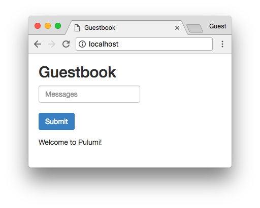

[](https://app.pulumi.com/new?template=https://github.com/pulumi/examples/blob/master/kubernetes-py-guestbook/components/README.md#gh-light-mode-only)
[](https://app.pulumi.com/new?template=https://github.com/pulumi/examples/blob/master/kubernetes-py-guestbook/components/README.md#gh-dark-mode-only)

# Kubernetes Guestbook (with Components)

A version of the [Kubernetes Guestbook](https://kubernetes.io/docs/tutorials/stateless-application/guestbook/)
application using Pulumi. Unlike [the straight port of the original YAML](../simple), this variant
leverages real code to eliminate boilerplate. A `ServiceDeployment` class is used that combines the common pattern
of deploying a container image using a Kubernetes `Deployment`, and then scaling it using a `Service`.

## Running the App

Follow the steps in [Pulumi Installation](https://www.pulumi.com/docs/get-started/install/) and [Kubernetes Setup](https://www.pulumi.com/docs/intro/cloud-providers/kubernetes/setup/) to get Pulumi working with Kubernetes.

Create a new stack:

```sh
$ pulumi stack init
Enter a stack name: testbook
```

This example will attempt to expose the Guestbook application to the Internet with a `Service` of
type `LoadBalancer`. Since minikube does not support `LoadBalancer`, the Guestbook application
already knows to use type `ClusterIP` instead; all you need to do is to tell it whether you're
deploying to minikube:

```sh
pulumi config set isMinikube <value>
```

Perform the deployment:

```sh
$ pulumi up
Previewing update (guestbook):

     Type                                 Name                      Plan
 +   pulumi:pulumi:Stack                  guestbook-easy-guestbook  create
 +   ├─ k8sx:component:ServiceDeployment  frontend                  create
 +   │  ├─ kubernetes:apps:Deployment     frontend                  create
 +   │  └─ kubernetes:core:Service        frontend                  create
 +   ├─ k8sx:component:ServiceDeployment  redis-replica             create
 +   │  ├─ kubernetes:apps:Deployment     redis-replica             create
 +   │  └─ kubernetes:core:Service        redis-replica             create
 +   └─ k8sx:component:ServiceDeployment  redis-leader              create
 +      ├─ kubernetes:apps:Deployment     redis-leader              create
 +      └─ kubernetes:core:Service        redis-leader              create

Resources:
    + 10 to create

Do you want to perform this update? yes
Updating (guestbook):

     Type                                 Name                      Status
 +   pulumi:pulumi:Stack                  guestbook-easy-guestbook  created
 +   ├─ k8sx:component:ServiceDeployment  redis-leader              created
 +   │  ├─ kubernetes:apps:Deployment     redis-leader              created
 +   │  └─ kubernetes:core:Service        redis-leader              created
 +   ├─ k8sx:component:ServiceDeployment  frontend                  created
 +   │  ├─ kubernetes:apps:Deployment     frontend                  created
 +   │  └─ kubernetes:core:Service        frontend                  created
 +   └─ k8sx:component:ServiceDeployment  redis-replica             created
 +      ├─ kubernetes:apps:Deployment     redis-replica             created
 +      └─ kubernetes:core:Service        redis-replica             created

Outputs:
    frontend_ip: "10.105.48.30"

Resources:
    + 10 created

Duration: 21s

Permalink: https://app.pulumi.com/acmecorp/k8sjs-guestbook/updates/1
```

And finally - open the application in your browser to see the running application. If you're running
macOS you can simply run:

```sh
open $(pulumi stack output frontend_ip)
```

> _Note_: minikube does not support type `LoadBalancer`; if you are deploying to minikube, make sure
> to run `kubectl port-forward svc/frontend 8080:80` to forward the cluster port to the local
> machine and access the service via `localhost:8080`.


